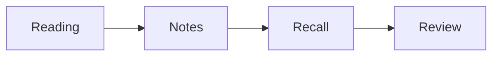

<div align="center">
  
  <h1>FocusFlow</h1>
  <p><strong>Your notes, research, deadlines, and learning—in one place.</strong></p>
  <p>A local-first desktop workspace for connected Markdown notes, focused study, active recall, and visual thinking.</p>

  [](https://github.com/CWE-119/focus-flow-dashboard/releases)
  [](https://github.com/CWE-119/focus-flow-dashboard/actions/workflows/release-windows.yml)
  
  
</div>

FocusFlow connects the work of learning: capture an idea, connect it to your
notes, plan around a deadline, study with a timer, and review what you remember.
Keep your data on your device, export your notes as Markdown, and optionally
connect Canvas LMS, Google Calendar, or your own private GitHub repository.

**No FocusFlow account or cloud database is required for local use.** Calendar
imports and GitHub sync need your own provider credentials and internet access.

[Get started](#get-started) · [Features](#features) · [Usage examples](#usage-examples) ·
[Calendar setup](#connect-your-calendars) · [Backups and sync](#backups-and-device-sync) ·
[Run from source](#run-from-source)

## Get started

### Install the desktop app

Open [GitHub Releases](https://github.com/CWE-119/focus-flow-dashboard/releases)
and check the release notes before choosing a Windows x64 download:

| Download | Use it when |
| --- | --- |
| Setup EXE | You want an installed app, shortcuts, and in-app update support. |
| Portable EXE | You want to run without installation and replace the executable manually for updates. |

Windows is the automated release target. macOS and Linux packaging commands are
included for local builds, but their release paths are not yet validated or
published automatically.

> This guide describes the current source on `main`. A published installer may
> contain an earlier feature set; build from source to use changes not yet tagged
> for release. Pushing code does not itself publish a new installer.

### Your first five minutes

1. Open **Notes** and create a folder for a course or project.
2. Create a note, write a few lines, and wait for the saved indicator.
3. Return to the **Dashboard**, start the timer, and save a completed session.
4. Open **Study & research** from the dashboard's Study schedule or the Notes
   tools menu. Create a workspace and link your note and saved session.
5. Select a passage in the note, choose **Create recall card**, and edit the
   question and answer. Review it in **Study → Active recall**.
6. In **Study → Backups & sync**, choose **Back up now**.

Use **Help** for the in-app guide and **?** for available keyboard shortcuts.

## Features

### Focus, tasks, and Activity

- Start, pause, reset, and save focus sessions; keep the active-session indicator
  visible as you navigate. Use the note timer when reading or writing.
- Review saved session history, session statistics, streaks, and the contribution
  calendar. Study-plan completion and flashcard reviews are separate from timed work.
- Create and edit tasks with priorities, due dates, categories, category colors,
  completion status, and filters. Repeat-rule settings are stored, but automatic
  creation of recurring task instances is not implemented.
- Set reminders and see in-app alerts while the app and backend are running.
- Import assignment and event end dates. Click an end date or an Activity day to
  see deadlines, source links, reminders, and recorded focus time together.
  Navigate between years, including future dates.
- Choose among 12 themes, use the live clock, and switch the audio visualizer
  between frequency bars and an ASCII-style fire grid. Audio capture requires
  permission and depends on your browser or operating system.

### Connected Markdown notes

- Organize notes into nested, collapsible, colored folders. Drag notes into
  folders, reorder top-level folders, and rename folders inline.
- Pin notes, mark them Important, reopen recent notes, add tags, create daily
  notes, and start from templates. Search by text or `#tag`; use the command
  palette to find notes and actions.
- Write Markdown with a live preview, headings, task lists, tables, callouts,
  LaTeX math and templates, syntax-highlighted code, images, and video embeds.
- Render Mermaid and DBML code fences as diagrams. Choose paper backgrounds and
  a banner-style highlight treatment for headings and lists.
- Autosave with visible save status, queue offline drafts, detect conflicting
  note edits, and restore earlier note versions.
- Connect notes using `[[Page]]`, open folders with `[[Folder]]`, or open/create
  a page with `[[Folder/Page]]`. Explore outgoing links, backlinks, missing links,
  and unlinked mentions.
- Switch between whole-vault and local graph views. Search, filter by folder,
  show or hide orphan notes, inspect missing-page ghost nodes, and hover for
  previews. Zoom, pan, drag nodes, pin focus, or double-click to open a note.
- Draw on note previews using pen, highlighter, shapes, and text. Select/move
  annotations, manage layers, lock or hide objects, and undo/redo.
- Import or export Markdown with annotation sidecars. Directory-picker export
  groups notes by folder; fallback downloads are separate files. Nested folder
  trees are flattened rather than round-tripped exactly. Imports de-duplicate
  note titles rather than overwrite notes.

### Course and research workspaces

- Create named course or research workspaces with descriptions.
- Link existing notes, assignments/deadlines, and focus sessions without moving
  or duplicating the underlying records.
- Keep a reading list of web links and mark readings complete.
- Generate a backward study plan using a linked deadline, total estimated effort,
  earliest start date, and maximum minutes per day.
- Check off study blocks and see linked focus-minute totals. Impossible plans
  are rejected; changed or unlinked deadlines display a plan warning.

### Active recall and glossary

- Maintain **Noted words**, a searchable glossary whose terms are highlighted
  in supported text views.
- Create editable question-and-answer cards from note selections or glossary
  definitions, or write cards directly in Active recall.
- Assign cards to workspaces and retain source-note links.
- Reveal an answer only after trying to recall it, then grade **Again**, **Hard**,
  **Good**, or **Easy** to schedule the next review.
- See due cards and planned study minutes on the dashboard. Manage all cards,
  edit questions, and filter reviews by workspace.

Cards are not generated by an external AI service. Scheduling is a simple
SM-2-inspired approach: Again retries in 10 minutes; the other grades use
day-based intervals that change with review history.

### Visual canvas

Create standalone drawings with pen, text, shapes, and images. Select and arrange
objects, change layering, undo/redo, autosave, and export a PNG. The canvas stays
separate from Markdown preview annotations and the focus dashboard.

### Local storage and continuity

- SQLite stores your saved workspace on your device.
- Daily encrypted local backups work without a cloud account.
- Manual backups, validated restore previews, and recovery copies help you
  recover from mistakes.
- Portable passphrase-encrypted export/import transfers saved workspace data.
- Optional private-GitHub sync supports multiple devices with explicit
  whole-workspace conflict resolution.

## Usage examples

### 1. Prepare for an exam without last-minute cramming

1. Create a **Course** workspace named `Biology 101`.
2. Import your exam through Canvas LMS or Google Calendar using
   **Dashboard → End dates → Connections**.
3. In the workspace, choose **Link existing → Assignment / deadline**, select
   the exam, and press **Link item**. Link your lecture notes the same way.
4. Under **Plan backwards from a deadline**, choose the exam and enter:
   - **Total estimated minutes:** `240`
   - **Maximum minutes per day:** `60`
   - **Start no earlier than:** at least four calendar days before the exam.
5. Press **Generate study plan**. For an exam on October 10, with an earliest
   start of October 5, this produces four 60-minute blocks on October 6–9.
6. Study with the timer, save each session, and link it to the workspace.
   Check off each study block separately when its work is complete.
7. Select the exam day in Activity to review its deadline and recorded work.

The due day is excluded from planning. If an imported date changes, review the
warning and remove the old plan steps before generating a replacement; existing
plans are not silently overwritten.

### 2. Build connected lecture notes

Create notes named `Cell membranes` and `Osmosis`, then paste this into
`Cell membranes`:

```markdown
# Cell membranes

## Key idea
A membrane controls the movement of substances into and out of a cell.

## Connections
- Water movement: [[Osmosis]]
- Course overview: [[Biology 101/Overview]]

## Questions to revisit
- [ ] Explain selective permeability without looking at the textbook.
- [ ] Compare diffusion and active transport.

## Quantitative model
$$J = -D\frac{dC}{dx}$$

## Sources
- [OpenStax Biology](https://openstax.org/details/books/biology-2e)
```

Create the `Biology 101` folder before following its page link. Add a
`biology` tag in the editor header, search `#biology`, and open **Graph view**
to explore the connections. Use backlinks to find notes that reference
`Cell membranes`.

To include a diagram, add a Mermaid fence:

````markdown

````

Switch to preview to render it. Use the annotation tools to mark the preview;
use version history to recover an earlier saved text revision.

### 3. Turn a definition into a review habit

1. In **Notes → tools menu → Noted words**, add:
   - **Term:** `Osmosis`
   - **Definition:** `Net movement of water across a selectively permeable membrane.`
2. Choose **Create recall card** and change the question to
   `What moves during osmosis, and what kind of membrane is involved?`
3. Assign the card to `Biology 101` and save it.
4. Open **Study → Active recall**, select that workspace, and answer from memory.
5. Press **Show answer**, then choose a grade honestly. Use **Again** when you
   need another attempt, not merely to finish the queue.
6. Return when the dashboard shows cards due.

For a source-linked card, select text in a note and use **Create recall card**
there instead. Questions and answers remain editable.

### 4. Organize a research reading project

1. Create a **Research project** workspace named `Urban heat literature review`.
2. Put your research question and inclusion criteria in its description.
3. Add article titles and URLs to the reading list.
4. Create one Markdown note per paper with sections for source URL, main claim,
   methods, evidence, limitations, and your questions.
5. Link related concepts with wiki links and inspect the local graph.
6. Link the paper notes and saved reading sessions to the workspace, mark
   readings complete, and use Canvas to sketch a concept map.
7. Export the Markdown folder when sharing or moving your written notes.

Reading entries store links; they do not download papers. Citation-manager
integration and automatic DOI/BibTeX import are not included.

### 5. Move to another device safely

1. Wait for notes to save and close other editing windows.
2. Open **Study → Backups & sync → Portable encrypted export / import**.
3. Enter a strong file passphrase of at least 12 characters and choose
   **Download encrypted export**. Store the passphrase separately.
4. On the other device, run the same app version, enter the passphrase, and
   **Choose encrypted file**.
5. Inspect the restore preview. When ready, choose
   **Restore this snapshot & reload**.
6. Reconnect calendars and adjust appearance preferences on the new device.

Restore replaces the saved workspace, not just one note. A local recovery
snapshot is created before replacement. For ongoing device sync, use the GitHub
setup below.

## Connect your calendars

Connections import dates **into FocusFlow**; they do not edit provider calendars,
submit assignments, or track assignment completion.

| Source | What to enter in End dates → Connections |
| --- | --- |
| Canvas LMS | Your school's HTTPS root URL, such as `https://school.instructure.com`, and a personal access token allowed by the school. This is Canvas LMS, not Canva. |
| Private Google Calendar | Calendar ID (`primary` is supported) and an OAuth access token with read-only Calendar events access. |
| Public Google Calendar | Public calendar ID and a Google Cloud API key with Calendar API access. An API key cannot read a private calendar. |

Choose **Save connection**, then **Sync now**. Imports cover the past 30 days and
the next 365 days. Enable automatic sync for 15-minute checks while the backend
runs. Google recurring events appear as individual occurrences; all-day events
use their final calendar day.

For long-lived Google access, open **Automatic Google token refresh** and supply
your own OAuth client details and offline refresh token. There is no built-in
Google sign-in flow. Without refresh credentials, access tokens need manual
replacement.

Sync updates changed dates without duplicate imports. Failed imports preserve
previous saved dates; disconnecting removes local credentials but keeps dates.
See the [calendar connection guide](docs/deadline-integrations.md) for token
setup, provider behavior, timezone handling, and troubleshooting.

## Backups and device sync

### Automatic and manual local backups

Daily backups run while the backend is running. Keep the latest 30 automatic
snapshots; manual and recovery copies remain until removed outside the app.
Use **Back up now** for a manual snapshot and **Preview restore** to validate one
without changing live data.

Local snapshots live in `<database>.backups/` and require the matching
`<database>.integrations.key` file. Prefer portable encrypted export when moving
data to another computer.

### Private GitHub sync

1. Create a **dedicated private repository for app data**, initialized with a
   README. Do not use the FocusFlow source-code repository.
2. Create a fine-grained GitHub token restricted to that repository with
   **Contents: read and write**.
3. In **Study → Backups & sync**, enter the GitHub owner, repository name, token,
   and a strong passphrase of at least 12 characters.
4. Choose **Save settings**, then **Sync now**.
5. On another device, use the same app version, repository, and passphrase.
   If prompted on the initial sync, choose the GitHub workspace after inspecting
   the comparison and backing up any local work.

The app writes an encrypted snapshot to `focusflow/workspace.enc.json` on the
repository's default branch. Optional automatic sync checks every 15 minutes
while the backend runs and uploads safe local changes. Remote changes wait for
a manual **Sync now** before replacing local data.

**Conflicts select a whole workspace, not individual notes.** Choose
**Keep this device & publish** or **Use GitHub & reload** only after reviewing the
comparison. The other snapshot is saved locally for recovery. GitHub cannot
recover a forgotten encryption passphrase.

### What is protected and what is included

Snapshots include saved notes and versions, folders, links, annotations,
drawings, tasks and categories, reminders, focus history, deadlines, glossary,
workspaces, reading lists, study plans, flashcards, and review history.

They exclude provider credentials, local connection settings, browser appearance
preferences, and unsaved/offline drafts. External URLs remain links, not archived
attachments. Encrypted files are limited to 32 MB; decompressed snapshots to
128 MB. See [study and sync details](docs/study-and-sync.md) for restore validation
and recovery behavior.

Backups and GitHub payloads are encrypted; **the working SQLite database is not
an encrypted vault**. Protect your device and use operating-system disk
encryption when needed. Locally encrypted credentials rely on a key stored
alongside the database. GitHub can still see snapshot sizes and commit times.

## Keyboard shortcuts

Shortcuts apply on screens that support the action. Navigation and timer keys
avoid text entry where appropriate; browser and OS shortcuts may take precedence.
Use `Cmd` in place of `Ctrl` on macOS.

| Shortcut | Action |
| --- | --- |
| `Alt+1` / `Alt+2` / `Alt+3` / `Alt+0` | Dashboard / Notes / Canvas / Help |
| `?` or `Ctrl+/` | Open shortcuts |
| `Space` | Start/pause the dashboard timer outside text fields |
| `Ctrl+R` / `Ctrl+Shift+S` | Reset timer / save focus session |
| `Ctrl+J` / `Ctrl+Shift+R` | New task / new reminder |
| `Ctrl+N` / `Ctrl+Shift+N` | New note / new folder |
| `Ctrl+S` / `Ctrl+K` | Save note / open Notes command palette |
| `Ctrl+B` / `Ctrl+L` | Toggle folders / toggle note list |
| `Ctrl+Shift+E` / `Ctrl+Shift+I` | Editor/preview / Important |
| `Ctrl+Shift+H` / `Ctrl+Shift+T` | Highlight style / cycle theme |
| `Esc` | Close a dialog or collapse a panel |

Help also lists drawing and annotation tool shortcuts.

## Run from source

### Requirements and desktop development

Use Node.js 22.12 or later in the Node 22 line and npm. The Windows release
workflow uses Node 22.12. Native SQLite installation may require platform build
tools if a prebuilt binary is unavailable.

```bash
git clone https://github.com/CWE-119/focus-flow-dashboard.git
cd focus-flow-dashboard
npm ci
npm run dev:electron
```

Electron starts the local API and Vite supplies the development UI. No separate
cloud database, account signup, or `.env` file is required.

### Browser development

Run these in two terminals from the project root:

```bash
# Terminal 1: local Express + SQLite API
npm --prefix backend start

# Terminal 2: React development server
npm run dev
```

Open `http://localhost:3000`; the API defaults to
`http://localhost:5000/api`. Browser development does not provide Electron's
window controls or desktop updater.

### Configuration and data location

| Variable | Purpose |
| --- | --- |
| `PORT` | Backend port for browser development; default `5000`. Keep the desktop API on its expected port. |
| `FOCUSFLOW_DB_PATH` | Override the standalone backend's SQLite path. Electron chooses its own writable user-data path. |
| `VITE_API_URL` | Browser API base URL, including `/api`, supplied when starting Vite or building. |
| `FOCUSFLOW_FRONTEND_ORIGIN` | Additional exact permitted browser origin for local connection and backup endpoints. |
| `FOCUSFLOW_DISABLE_MAINTENANCE=1` | Disable the maintenance loop for automated backups and provider/device sync. |

The standalone backend defaults to `backend/focusflow.db`. Electron uses
`focusflow.db` in its application user-data directory, separate from installed
program files. The backend prints the database path at startup.

This is a local single-user app, **not a hardened multi-user hosted service**.
Do not expose the API to the public internet. Changing a browser API URL does
not add authentication or make remote deployment safe.

## Build, test, and contribute

| Command | Purpose |
| --- | --- |
| `npm run dev` | Start the browser development server |
| `npm run dev:electron` | Start desktop development with the local API |
| `npm run lint` | Run ESLint |
| `npx tsc --noEmit -p tsconfig.app.json` | Type-check the renderer |
| `npm run test` | Run frontend tests |
| `npm run test:backend` | Run backend tests with temporary databases and simulated providers |
| `npm run build` | Build the production renderer |
| `npm run build:electron:win` | Build Windows installer and portable packages |
| `npm run build:electron:mac` / `npm run build:electron:linux` | Build platform targets locally; verify on the target OS |
| `npm run release:check` | Run release guards, tests, and the production build |
| `npm run clean:electron` | Clean generated Electron output; locked files may need the running app closed first |

Run lint, type-checking, and release checks before opening a pull request.
Do not commit personal databases, credentials, local encryption keys, or backups.
Provider tests simulate accounts; they do not certify your own live credentials.
See [Windows releases](docs/WINDOWS_RELEASES.md) for packaging, signing, and updater
verification. Publishing installers requires the documented version/tag workflow.

### Project structure

```text
src/
  components/       Dashboard, notes, study, recall, backup, and canvas UI
  contexts/         Shared notes, reminders, sessions, themes, and note timer
  hooks/            Local data loading and keyboard shortcuts
  lib/              API clients, routing, wiki links, and Markdown portability
  pages/            Dashboard, Notes, Study, Canvas, Help, and showcase scenes
  test/             Frontend regression tests
backend/
  index.js          Express API, SQLite schema, and application startup
  study.cjs         Workspaces, study planning, cards, and reviews
  continuity.cjs    Encrypted snapshots, restore, and GitHub synchronization
  deadline-*.cjs    Canvas and Google imports and connection management
  test/             Backend regression tests
electron/           Desktop lifecycle, updates, and restricted preload bridge
scripts/            Packaging, output cleanup, and release guards
docs/               Detailed setup, recovery, releases, and proposed roadmap
```

### Product screenshot studio

The showcase routes use deterministic demo data and do not write to the user's
database. Start Vite and open `/showcase` for the scene picker, or visit
`/showcase/focus`, `/showcase/notes`, and `/showcase/graph`.
Add `?capture=1` to hide studio controls; use a 1400 × 900 viewport for consistent
framing. These are promotional scenes, not screenshots of your live workspace.

## Troubleshooting

| Problem | What to check |
| --- | --- |
| Notes or Study cannot load | In browser development, start both terminals. In desktop development, inspect the backend startup log and check whether port 5000 is occupied. |
| Calendar sync fails | Recheck the Canvas root URL, provider permissions, token validity, calendar ID, and internet connection. A public API key cannot access a private calendar. |
| Automatic work did not run while the app was closed | Backups, scheduled sync, and in-app reminder checks require the backend/app to run; they are not OS background jobs. |
| GitHub sync shows a conflict | Save drafts, create a backup, compare snapshots, and choose which whole workspace to retain. Do not assume records will be merged. |
| A restore is rejected | Check the passphrase, use the same app version, and request a new preview if local data changed. Do not delete the local encryption key. |
| An exported note loses an external image offline | Linked URLs are not downloaded or bundled; keep the referenced resource available separately. |
| Audio visualization is silent | Grant capture permission, choose an audio-capable source, and check platform support. |
| Markdown export cannot choose a directory | Use a browser/runtime with directory-picker support; other environments use the fallback downloads. |

## Project notes

This README documents implemented behavior; proposed additions are kept in the
[research and education roadmap](docs/research-education-roadmap.md), not
advertised as shipping features. Google Drive sync, native mobile clients,
automatic recurring-task generation, and built-in citation management are not
included.

Bug reports and focused contributions are welcome through
[GitHub Issues](https://github.com/CWE-119/focus-flow-dashboard/issues).
Include your OS, app version, steps to reproduce, and sanitized logs—never
tokens or private notes.

**License:** this repository currently has no software license file. Public
availability is not a grant of general redistribution or commercial reuse
rights; resolve licensing with the relevant rights holders before redistribution.
